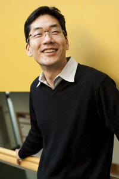
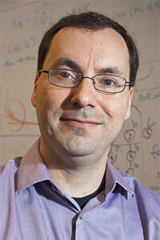
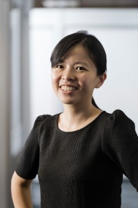

# ACT: Architectural Carbon Modeling Tool

## Abstract
**Motivation:** Over the past two decades, the world has witnessed a dramatic rise in computing across data centers, mobile, and communication technologies. As of 2015 information computing technology (ICT) accounts for up to 3% of global carbon emissions. Unfortunately, as the demand for computing grows with new applications and platforms so will its energy demand. Many technology companies, including Microsoft, Google, Facebook, and Amazon, have pledged to reduce their carbon footprints over the next decade. Meeting these pledges and enabling sustainable computing requires immediate action from the systems and architecture community.

**Background:** In addition to its importance, enabling environmentally sustainable computing introduces unique challenges to system and hardware design. First, carbon emissions are shifting from being dominated by operational energy consumption to hardware manufacturing. Traditionally the majority of emissions owe to operational hardware use (i.e., energy consumption). However, given the energy efficiency optimizations and increasing fabrication complexity, the majority of carbon emissions have shifted to hardware manufacturing. Given these new challenges, enabling environmentally sustainable computing demands distinct solutions across the computing stack, hardware life cycles, and end-to-end systems.

**This tutorial:** A fundamental bottleneck to conducting sustainability aware hardware design space exploration and optimization is the lack of carbon accounting tools. To address this gap, here we propose a tutorial for ACT, the first-of-its-kind architectural carbon modeling tool. ACT enables computer architects to quantify the embodied carbon footprint of hardware during early design space exploration — allowing designers to consider carbon as a first-order optimization target alongside performance, power, and energy. In this tutorial, we aim to provide a holistic overview of the sustainability implications of modern computer systems at the datacenter and mobile scale (motivation for ACT), an overview of the proposed ACT methodology, hands on demonstration for how to use ACT, and hands on demonstration for how to extend ACT in new ways. We believe such a tutorial will build a strong foundation for researchers across computer architecture, circuits and VLSI, and systems, to incorporate carbon analyses in their research.

## This tutorial
The inaugural `ACT` tutorial will be held at [MICRO 2022](https://www.microarch.org/micro55/) in Chicago and presented by Udit Gupta.

| Time  | Topic | Link |
| ------------- | :-------------: | :-------: |
| 9:00 - 9:15am  | Introduction to `ACT`  | Link coming |
| 9:15 - 9:30am  | Sustainable Computing: Motivation and Challenges  | Link coming |
| 9:30 - 10:15am  | Overview of `ACT`: An Architectural Carbon Modeling Tool  | Link coming |
| 10:15 - 10:30am  | _Coffee Break_  |
| 10:30 - 11:00am  | **Demo**: How to use `ACT`  | Link coming | 
| 11:00 - 11:15am  | **Demo**: How to extend `ACT`  | Link coming | 
| 11:15 - 11:45am  | _Office hours_: `ACT` and sustainable computing  | 
| 11:45 - 12:00pm  | Closing remarks  | Link coming | 


## Sign up for updates

## Citation
If you use `ACT`, please cite us: 

```
@inproceedings{gupta2022act,
  title={ACT: designing sustainable computer systems with an architectural carbon modeling tool},
  author={Gupta, Udit and Elgamal, Mariam and Hills, Gage and Wei, Gu-Yeon and Lee, Hsien-Hsin S and Brooks, David and Wu, Carole-Jean},
  booktitle={Proceedings of the 49th Annual International Symposium on Computer Architecture},
  pages={784--799},
  year={2022}
}
```

## Contact us
For any further questions please contact <ug28@cornell.edu>

## About us

|  |  Organizer |
| ------------- | :------------- | 
|  | **Udit Gupta** (Cornell Tech/FAIR) will be joining Cornell Tech as an Assistant Professor in summer 2023. Currently, he is a visiting research scientist at Meta AI. His research spans across computer architecture, systems, and machine learning. Generally, he is interested in discovering and demonstrating new ways to design systems and hardware to improve the performance, efficiency, and environmental sustainability of emerging applications. | 
|  | **Gu-Yeon Wei** (Harvard) is a Professor of Electrical Engineering at Harvard University. His research interests span a variety of topics such as integrated voltage regulators, flexible voltage stacking, power electronics, low-power computing architectures and circuits, auto-parallelizing compilers, and more.| 
|  | **David Brooks** (Harvard) is a Professor of Computer Science at Harvard University. His research focuses on the interaction between the architecture and software of computer systems and underlying hardware implementation challenges, including power, reliability, and variability issues across embedded and high-performance computing systems.  | 
|  | **Carole-Jean Wu** (FAIR) is a Research Scientist at Meta AI. Her research focus lies in the domain of computer system architecture with particular emphasis on energy- and memory-efficient systems. Her research has pivoted into designing systems for machine learning execution at-scale. In general, she is interested in tackling system challenges to enable efficient, responsible AI execution. | 
